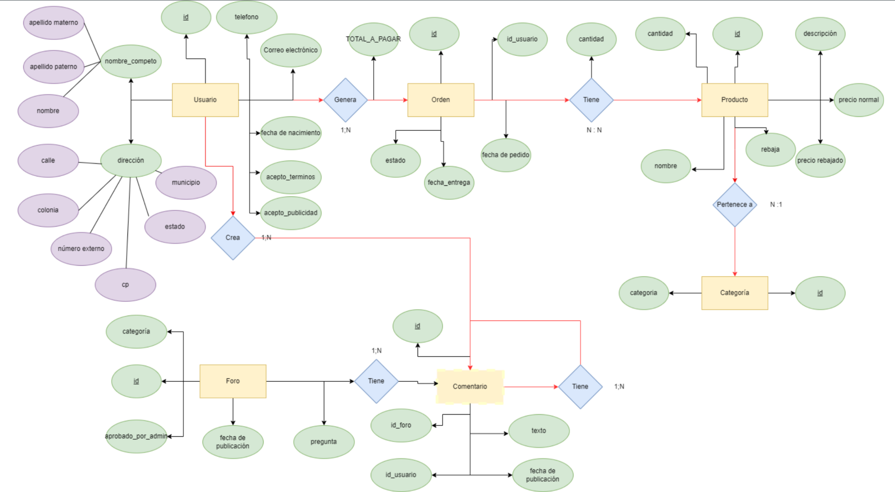

# Todas Brillamos
**Autores**: *Carlos Iker Reyes, Santiago Chevez Trejo, Andrés Cabrera Alvarado, Alan Rodrigo Vega Reza, Cesar Augusto Flores Reyes*.

## Proposito

Desarrollar una aplicación para celulares que actúe como una tienda virtual de sus productos de toallas femeninas reutilizables, fuente de información para eliminar mitos sobre la menstruación, creación de una comunidad (*blogs y foros*)  para que las personas puedan interactuar y compartir información sobre el tema de la menstruación. Asimismo, desean una página de administración que les permita administrar sus pedidos, ver estadísticas de las ventas y en sí manejar toda la información pertinente de la aplicación.

## Analisis

Habiendo conocido los requerimientos del socio-formador, el equipo de trabajo ha establecido los siguientes objetivos para el desarrollo del proyecto

Como equipo, proponemos un proyecto que cumpla lo siguiente:
1. Una aplicación móvil para Android que cuente con una tienda virtual. Ésta permitirá visualizar un catálogo de los productos de la organización socio-formadora, junto con las descripciones, precios e imágenes de cada uno. Asimismo, la tienda tendrá conexión con un servicio de pago (pendiente de un estudio de factibilidad, podría ser CLIP o Paypal). Los pagos serían procesados y órdenes de compra serían generadas y almacenadas en la base de datos. 
2. Que la aplicación móvil tenga un apartado de foros en el cual los usuarios puedan discutir sobre el tema de la menstruación y pedir consejo. 
3. Una página de administración desarrollada en Oracle APEX que permita visualizar información de los productos, actualizarlos y añadir nuevos en caso de ser necesario. Asimismo mostrará las órdenes realizadas (con la información pertinente), un listado de los usuarios registrados en la aplicación.
4. La página de administración además proveerá una visualización de las estadísticas de venta de los productos. 

El equipo de trabajo dictaminó que estos objetivos son los más importantes para poder cumplir con los objetivos de la organización socio-formadora, puesto que engloban los comentarios que hicieron respecto a sus necesidades actuales.

## Diagrama Base de Datos
Aquí tenemos nuestro diseño para la base de datos. 

El diagrama cuenta con 6 entidades (3 de las cuales se basaron en la información proporcionada por el socio-formador). 
1. Usuario. [Datos de cuenta y dirección de envío] 
2. Foro [Pregunta clave que detona la conversación]
3. Comentario [Respuesta al foro o a otro comentario. Esta es una entidad débil ya que no existe no no se tiene un foro] 
4. Orden [Pedido realizado por el usuario]
5. Producto [Productos que se encuentran disponibles para la venta]
6. Categoría [Clasificación de productos]

## Enlace página de administración

Aquí pueden ver nuestra página de administración desarrollada en Oracle Apex:
[Zazil-TodasBrillamos](https://apex.oracle.com/pls/apex/r/todasbrillamos/zazil-todasbrillamos).

## Recursos

- ***Retrofit***
- ***Gson***
- ***okhttp***
- ***CoroutinesRetrofit***
- ***Paypal API***
- ***Client-Server Authentication***
- ***Oracle Apex***

### Información Legal    
> [!NOTE]
> Derechos de autor © Derechos Reservados a los autores y organización 2023 Toallas Femeninas Zazil
